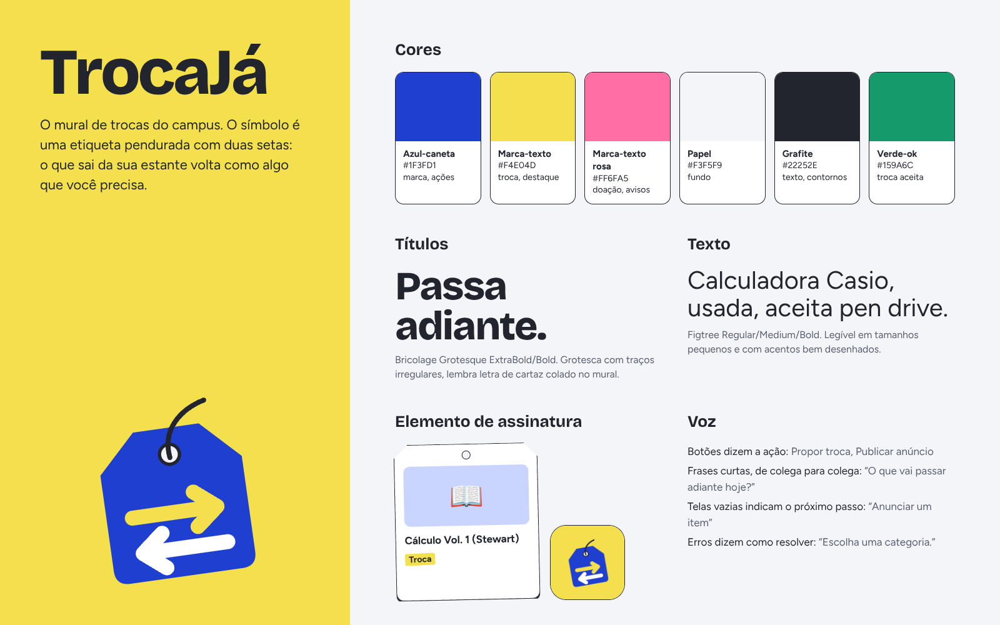
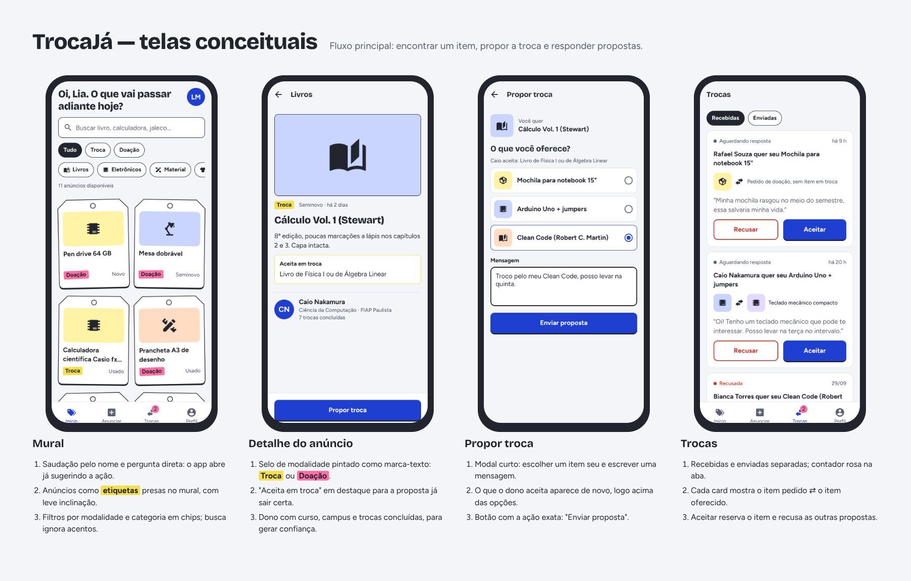

# Marca e identidade visual — TrocaJá

## Nome

**TrocaJá** junta a ação principal do app (trocar) com a urgência do dia a dia do estudante (já, antes do semestre começar). É curto, fácil de falar e funciona como verbo: "troca já no app".

## Conceito

O app se inspira no **mural de avisos do campus**: etiquetas presas com fita, anotações de caneta azul e destaques com marca-texto. Esse vocabulário visual é familiar para o público e diferencia o TrocaJá de marketplaces genéricos.

## Logo

O símbolo é uma **etiqueta pendurada** (hang tag) com duas setas em sentidos opostos: o item que sai da sua estante volta como algo de que você precisa. O cordão passa pelo furo da etiqueta, como nas etiquetas de verdade.

| Arquivo | Uso |
| --- | --- |
| `assets/brand/logo-mark.svg` / `.png` | Símbolo isolado |
| `assets/brand/logo-horizontal.svg` / `.png` | Símbolo + nome |
| `assets/icon.png` | Ícone do app (fundo marca-texto, etiqueta inclinada) |
| `assets/android-icon-*.png` | Ícone adaptativo do Android (frente, fundo e monocromático) |
| `assets/splash-icon.png`, `assets/favicon.png` | Splash e navegador |

## Paleta

| Nome | Hex | Papel na interface |
| --- | --- | --- |
| Azul-caneta | `#1F3FD1` | Marca, botões principais, aba ativa |
| Marca-texto | `#F4E04D` | Selo "Troca", destaques, fundo do ícone |
| Marca-texto rosa | `#FF6FA5` | Selo "Doação", contador de propostas |
| Papel | `#F3F5F9` | Fundo das telas |
| Grafite | `#22252E` | Texto, contornos e sombra das etiquetas |
| Verde-ok | `#159A6C` | Proposta aceita |

Os tokens ficam em [`src/theme/tokens.ts`](../src/theme/tokens.ts) — nenhuma tela usa cor solta.

## Tipografia

| Família | Pesos | Uso |
| --- | --- | --- |
| **Bricolage Grotesque** | ExtraBold 800, Bold 700 | Títulos e nome do app. Grotesca com traços irregulares, parece letra de cartaz. |
| **Figtree** | Regular 400, Medium 500, Bold 700 | Texto, rótulos e botões. Boa leitura em tamanhos pequenos. |

Escala (razão ≈ 1,25): 13 · 16 · 20 · 25 · 31 px.

Ambas são do Google Fonts (licença OFL) e carregadas no app via `@expo-google-fonts`.

## Elemento de assinatura

O **card de anúncio em forma de etiqueta**: cantos superiores chanfrados, furo no topo, contorno grafite com sombra deslocada e uma leve inclinação alternada, como etiquetas presas no mural. É o único elemento "ousado"; o resto da interface é sóbrio para não competir com ele.

## Telas conceituais

Quadro com as quatro telas do fluxo principal em moldura de celular e as decisões de design de cada uma (feito em HTML/CSS com as fontes e cores da marca, no papel de "Figma ou similar"):

## Voz

- Botões dizem a ação exata: "Propor troca", "Publicar anúncio", "Enviar proposta".
- Frases curtas, de colega para colega: "Oi, Lia. O que vai passar adiante hoje?"
- Telas vazias indicam o próximo passo ("Anunciar um item").
- Mensagens de erro dizem como resolver ("Escolha uma categoria."), sem pedir desculpas.
