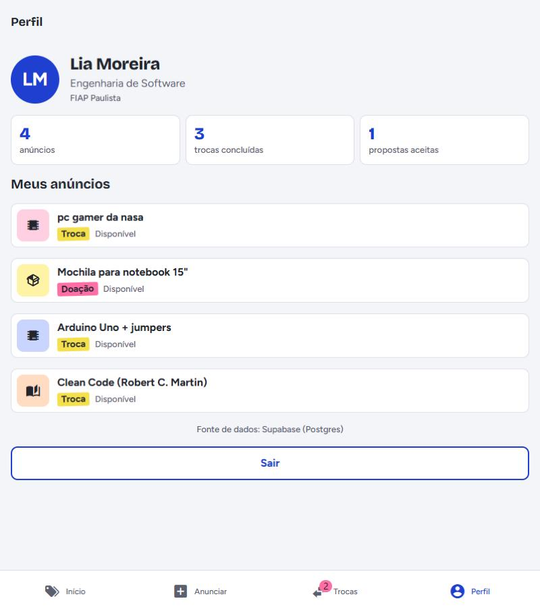
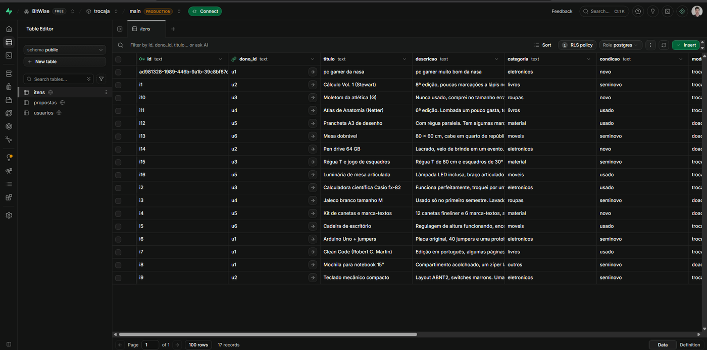

# Ambiente e roteiro de testes — TrocaJá

## Testes automatizados (Jest)

```bash
npm test                 # roda todos os testes
npm run test:watch       # modo observação
npx jest --coverage      # relatório de cobertura
npm run typecheck        # verificação de tipos (TypeScript)
```

Configuração: preset `jest-expo` no `package.json`, React Native Testing Library 14 e `test-renderer`.

| Arquivo | O que cobre |
| --- | --- |
| `__tests__/utils.test.ts` | Filtro e busca sem acento, formatação de datas e iniciais, validação dos formulários de anúncio e cadastro |
| `__tests__/repositorio.test.ts` | Repositório mock (ordenação, criação, aceitar proposta reserva o item e recusa concorrentes, isolamento entre instâncias, erro claro) e mapeamento Supabase snake_case → camelCase |
| `__tests__/componentes.test.tsx` | Renderização e toque na `Etiqueta`, botão desabilitado, fluxo do `AppContext`: login demo, anunciar, propor troca, e-mail desconhecido |

**Resultado na entrega da CP5:** 3 suítes, **33 testes passando**, ~73% das linhas cobertas, `tsc --noEmit` sem erros.

## Roteiro de testes manuais

Execute no emulador Android (Android Studio) ou no navegador (`npm run web`). Marque o resultado na última coluna.

| # | Cenário | Passos | Resultado esperado | OK? |
| --- | --- | --- | --- | --- |
| 1 | Entrar com conta demo | Abrir o app → "Entrar com a conta demo" | Abre o Início com "Oi, Lia…" e 11 anúncios | ✅ |
| 2 | Cadastro inválido | "Criar minha conta" → preencher só "Pedro" e e-mail "pedro@" → "Criar conta" | Erros em nome, e-mail, curso e campus | ✅ |
| 3 | Cadastro válido | Preencher nome e sobrenome, e-mail, curso e campus → "Criar conta" | Abre o Início com o primeiro nome | ✅ |
| 4 | Busca sem acento | Digitar "calculo" na busca | Só aparece "Cálculo Vol. 1 (Stewart)" | ✅ |
| 5 | Filtro combinado | Tocar "Doação" e depois "Eletrônicos" | Só "Pen drive 64 GB" | ✅ |
| 6 | Filtro sem resultado | Buscar "xyz" | Mensagem "Nada com esse filtro" e botão "Limpar filtros" | ✅ |
| 7 | Detalhe | Tocar em uma etiqueta | Mostra descrição, "Aceita em troca", dono e campus | ✅ |
| 8 | Propor troca sem item | No detalhe de um item de troca → "Propor troca" → "Enviar proposta" sem escolher | Erro "Escolha um dos seus itens para oferecer." | ✅ |
| 9 | Propor troca | Escolher "Clean Code", escrever mensagem → "Enviar proposta" | Alerta "Proposta enviada"; botão do detalhe vira "Proposta enviada" desabilitado | ✅ |
| 10 | Pedir doação | Abrir um item de doação → "Pedir doação" → mensagem → enviar | Proposta aparece em Trocas → Enviadas sem item oferecido | ✅ |
| 11 | Aceitar proposta | Trocas → Recebidas → "Aceitar" na proposta do Arduino | Status "Aceita", badge da aba diminui, Arduino fica "Reservado" no Perfil | ✅ |
| 12 | Recusar proposta | Recebidas → "Recusar" | Status "Recusada" | ✅ |
| 13 | Cancelar proposta | Enviadas → "Cancelar proposta" | Status "Cancelada" | ✅ |
| 14 | Anúncio inválido | Anunciar → "Publicar anúncio" com tudo vazio | Erros em título, categoria, condição, descrição e "aceita em troca" | ✅ |
| 15 | Erro some ao corrigir | Depois do cenário 14, digitar um título | O erro do título desaparece | ✅ |
| 16 | Publicar doação | Doar → título, categoria, condição e descrição → Publicar | Abre o detalhe do item novo; Perfil passa a mostrar 4 anúncios | ✅ |
| 17 | Item próprio | Abrir um anúncio seu | Não aparece botão de propor troca; dono aparece como "Você" | ✅ |
| 18 | Sair | Perfil → "Sair" | Volta para a tela Entrar | ✅ |
| 19 | Fonte de dados | Perfil (rodapé) | "mock local (JSON)" sem `.env`; "Supabase (Postgres)" com `.env` | ✅ |
| 20 | Supabase | Com `.env` configurado, publicar um anúncio | Linha nova em `itens` no Table Editor | ✅ |

**Resultado: 20 de 20 cenários aprovados.**

- 1 a 18 — no navegador com dados mockados, em 07/10/2026. Os cenários 1, 4, 7, 9, 11, 14 e 16 estão registrados em [`img/prints`](img/prints) e no vídeo [`img/fluxo-cp5.mp4`](img/fluxo-cp5.mp4).
- 19 e 20 — com o Supabase do grupo: o anúncio publicado no app aparece em "Meus anúncios" com a fonte "Supabase (Postgres)" e como linha nova na tabela `itens`.

| App lendo do Supabase | Linha nova no Table Editor |
| --- | --- |
|  |  |
