# Telas e fluxos de navegação — TrocaJá

Navegação com **Expo Router** (rotas por arquivo em `src/app/`): uma pilha (Stack) na raiz e quatro abas (Tabs) depois do login.

## Mapa de rotas

| Rota | Arquivo | Tela |
| --- | --- | --- |
| `/` | `src/app/index.tsx` | Entrar (conta demo ou cadastro) |
| `/inicio` | `src/app/(tabs)/inicio.tsx` | Mural de anúncios, busca e filtros |
| `/anunciar` | `src/app/(tabs)/anunciar.tsx` | Formulário de novo anúncio |
| `/trocas` | `src/app/(tabs)/trocas.tsx` | Propostas recebidas e enviadas |
| `/perfil` | `src/app/(tabs)/perfil.tsx` | Dados do usuário e meus anúncios |
| `/item/[id]` | `src/app/item/[id].tsx` | Detalhe do anúncio |
| `/propor/[id]` | `src/app/propor/[id].tsx` | Propor troca / pedir doação (modal) |

## Fluxo principal

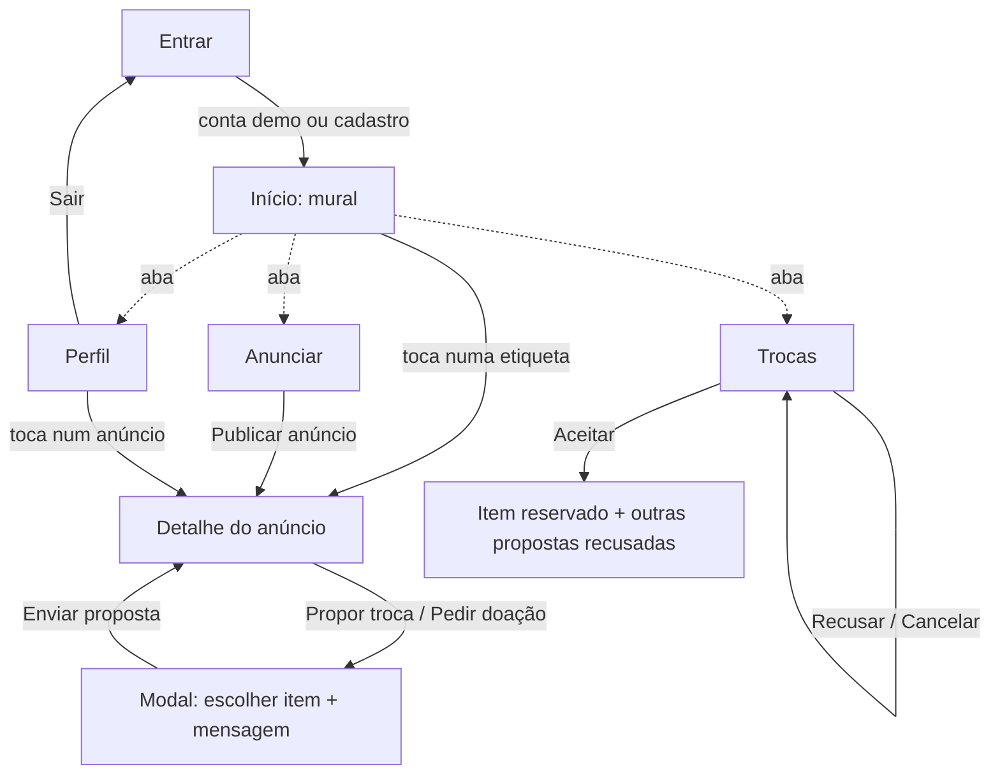

## Regras de negócio refletidas nas telas

- O mural mostra só itens **disponíveis** e esconde os anúncios do próprio usuário.
- A busca ignora acentos e maiúsculas e procura em título, descrição e "aceita em troca".
- Em **troca**, a pessoa precisa oferecer um item seu disponível; em **doação**, só a mensagem.
- Não é possível propor duas vezes para o mesmo item enquanto a primeira estiver pendente.
- **Aceitar** uma proposta reserva o item e recusa as outras propostas pendentes para ele.
- O badge da aba Trocas conta as propostas **recebidas pendentes**.

## Telas (protótipo rodando no navegador)

| Entrar | Início | Busca "calculo" |
| --- | --- | --- |
| 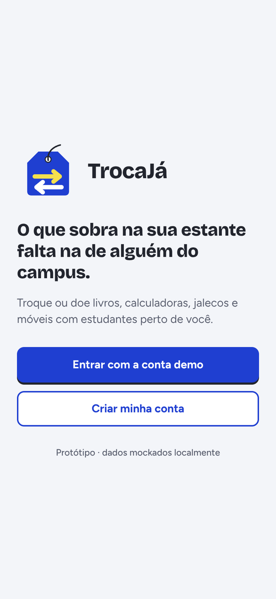 | 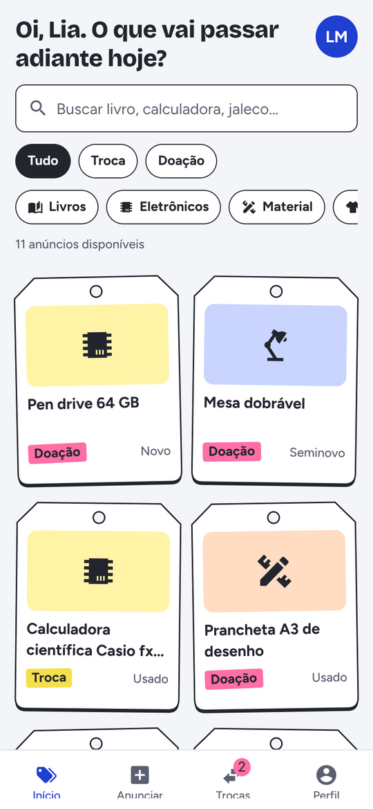 | 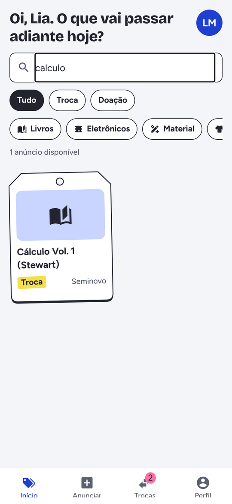 |

| Detalhe | Propor troca | Proposta enviada |
| --- | --- | --- |
| 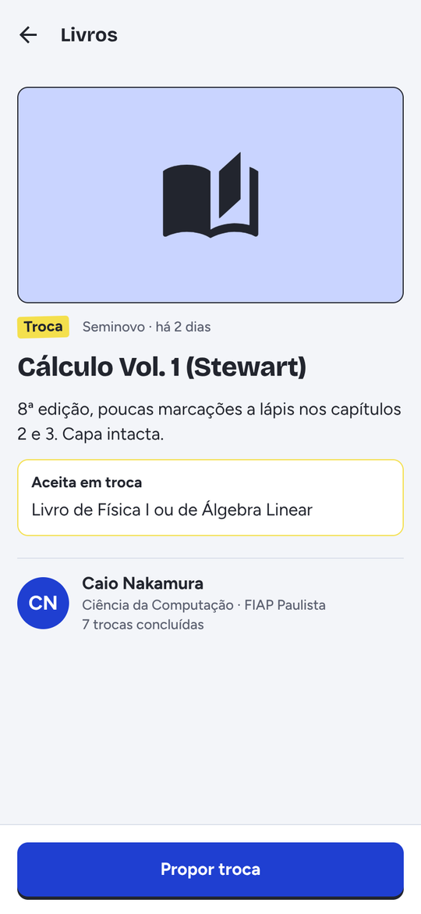 | 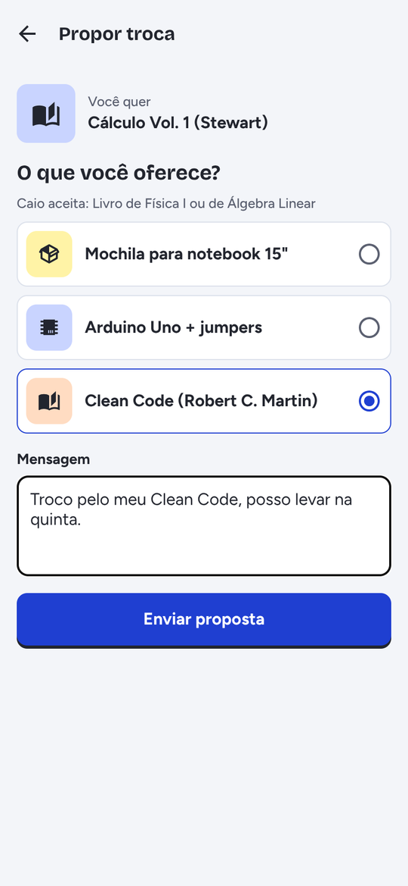 | 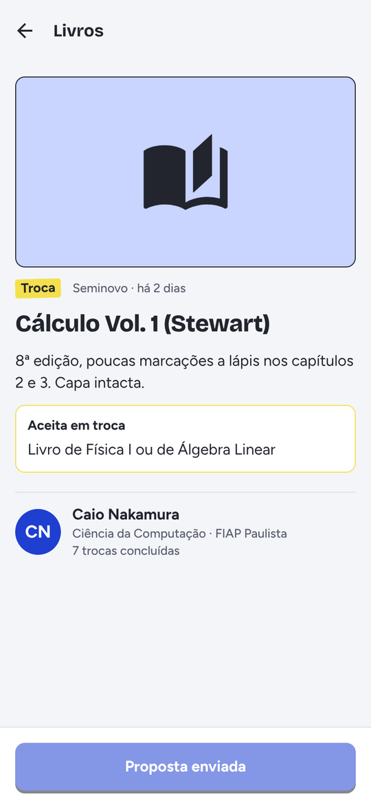 |

| Trocas recebidas | Proposta aceita | Enviadas |
| --- | --- | --- |
| 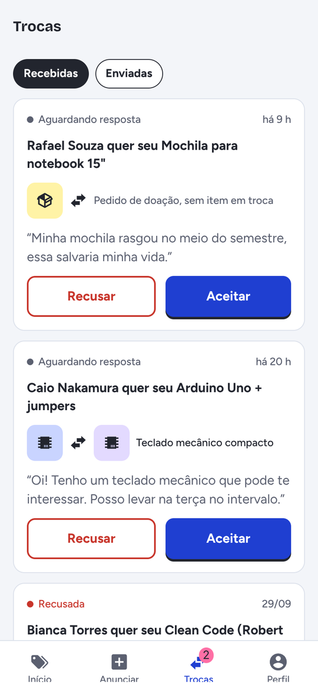 | 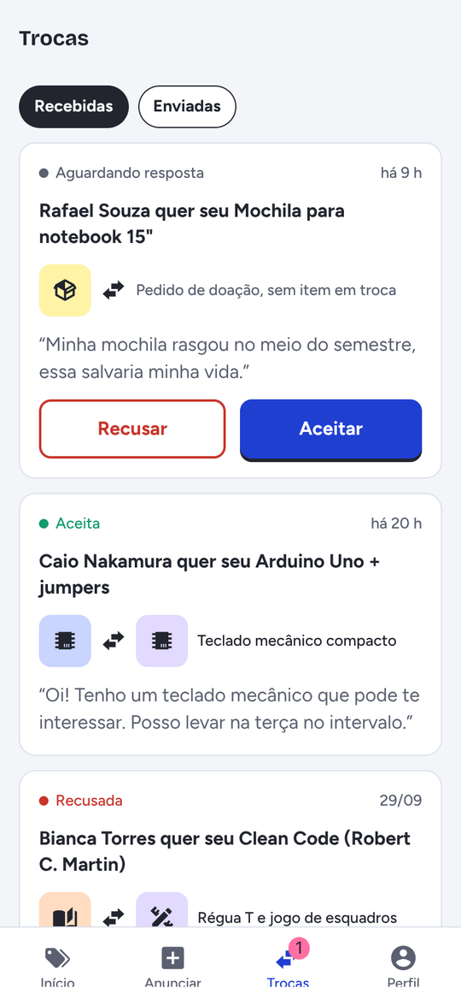 | 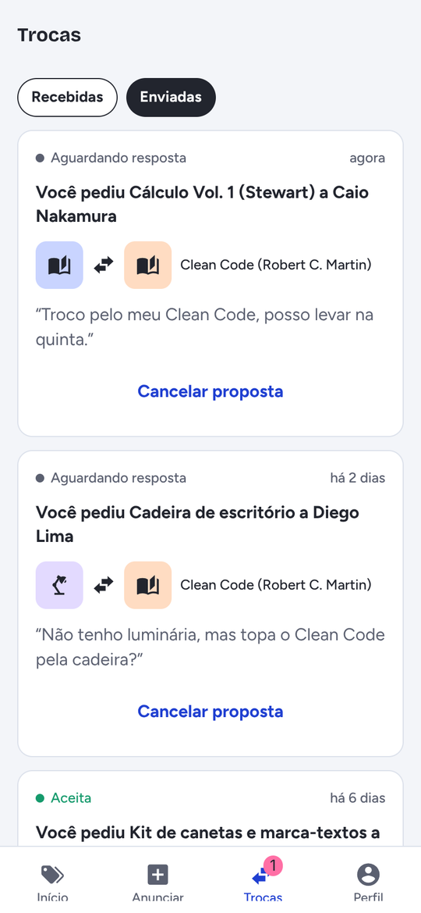 |

| Validação do anúncio | Anúncio preenchido | Anúncio publicado |
| --- | --- | --- |
| 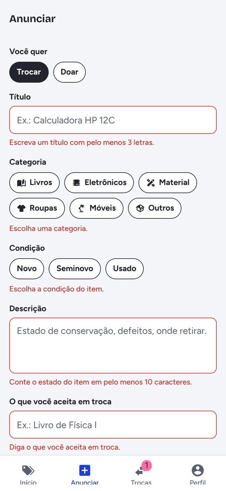 | 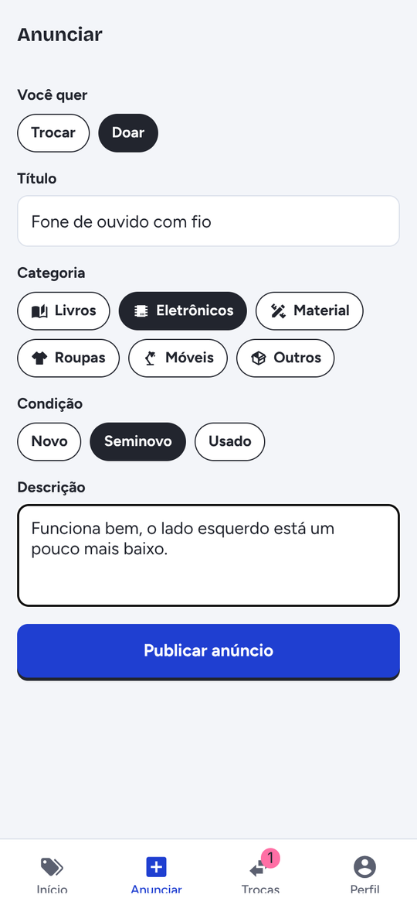 | 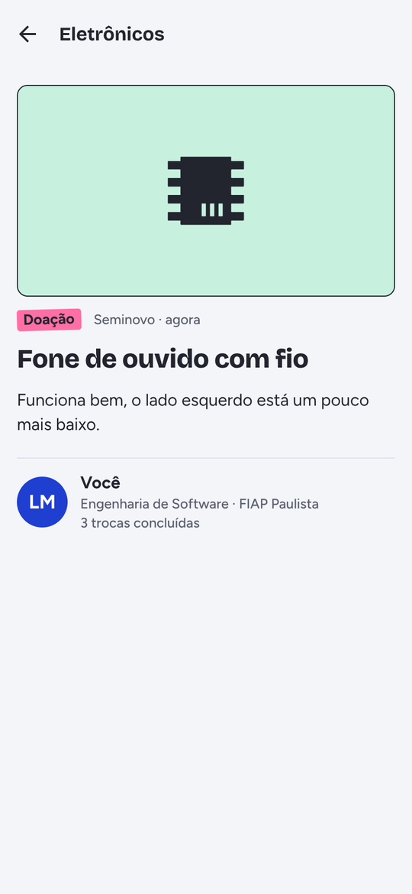 |

| Perfil |
| --- |
| 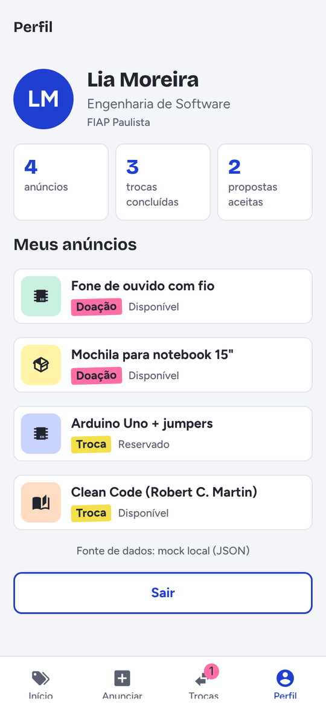 |

Vídeo do fluxo completo: [`img/fluxo-cp5.mp4`](img/fluxo-cp5.mp4).

## Rodando com o Supabase

| Perfil com fonte Supabase | Tabela `itens` com o anúncio criado no app |
| --- | --- |
|  |  |
